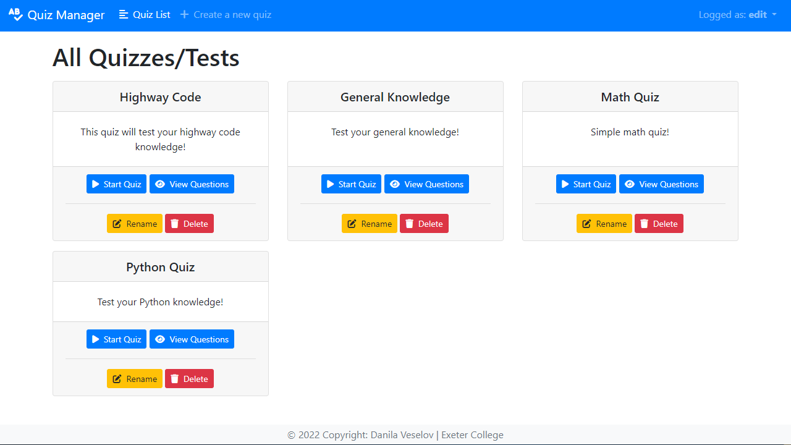
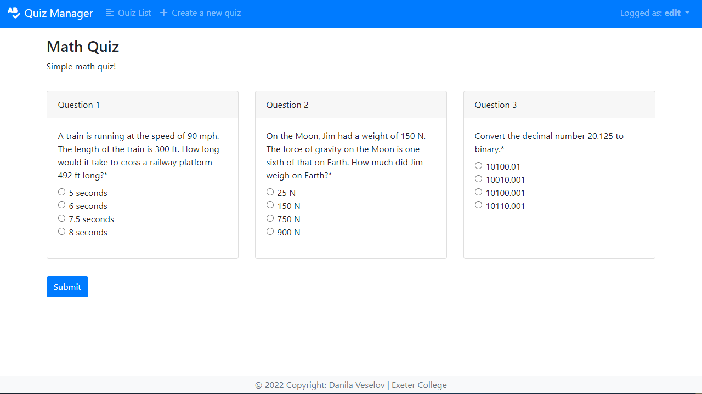
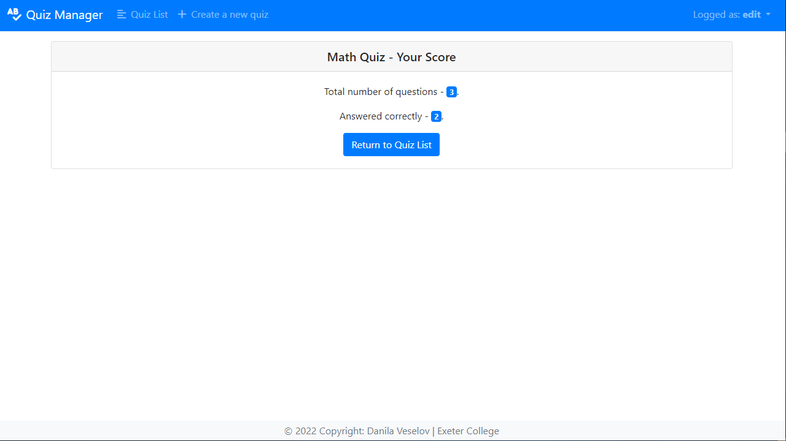
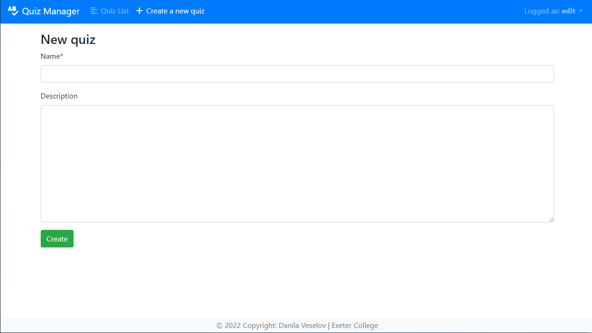
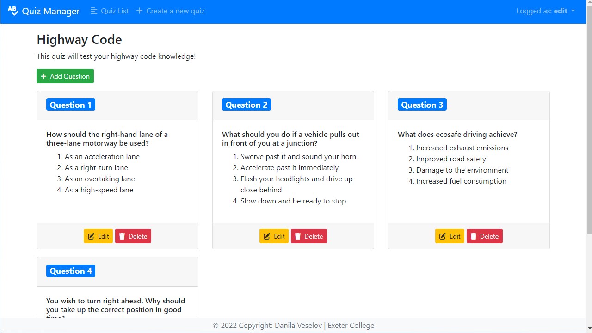

# Quiz App (Exeter College project)







## Overview

This is a comprehensive quiz application created with Django and Bootstrap, designed to enable users to create, view, and undertake quizzes with ease. With its user-friendly interface, multiple permission groups are available to ensure that users have access to specific functionalities based on their roles.

Users with edit permission can create quizzes with questions, add, edit or delete questions and answer choices. Users with view permission can only view and undertake quizzes, while users with restricted permissions can only view quizzes without any ability to undertake them.

## Usage

> Python3 Required (Tested with Python 3.9.5 and Python 3.10.5)
> To clone and run this application, you'll need Git and Python installed on your computer. From your command line:

Windows:

```bash
# Clone this repository
$ git clone https://github.com/danilaveselov/ytdownloader.git

# Go into the repository
$ cd ytdownloader

# Create a new virtual environment
$ py -3 -m venv .venv_project

# Activate your virtual environment
$ .venv_project\Scripts\activate

# Install required requirements
$ pip install requirements/requirements-minimal.txt

# Run the project with
$ python manage.py runserver
```

MacOS/Linux:

```bash
# Clone this repository
$ git clone https://github.com/danilaveselov/ytdownloader.git

# Go into the repository
$ cd ytdownloader

# Create a new virtual environment
$ python3 -m venv .venv_project

# Activate your virtual environment
$ .venv_project/bin/activate

# Install required requirements
$ pip install requirements/requirements-minimal.txt

# Run the project with
$ python manage.py runserver
```

## How to log in

```bash
# Edit permission login credentials
LOGIN – edit
PASSWORD – 1234
# View permission login credentials
LOGIN – view
PASSWORD – 1234
# Restricted permission login credentials
LOGIN – restricted
PASSWORD - 1234
```

#

Created as part of the programme at Exeter College.
